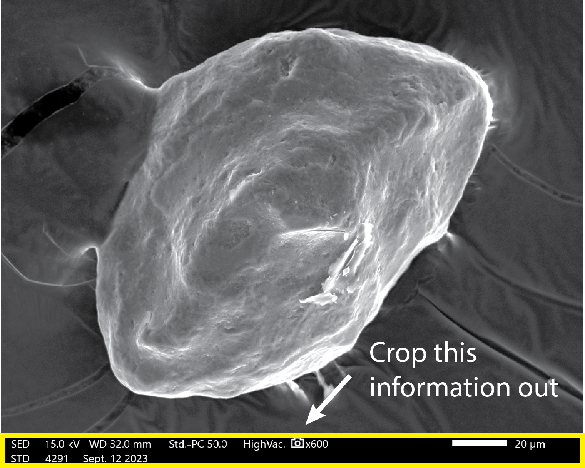
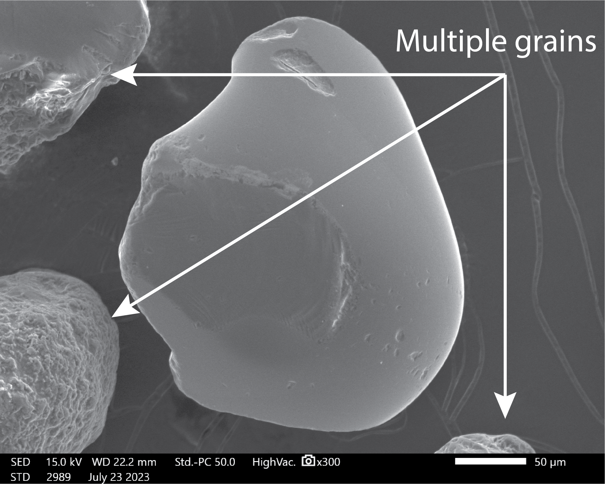
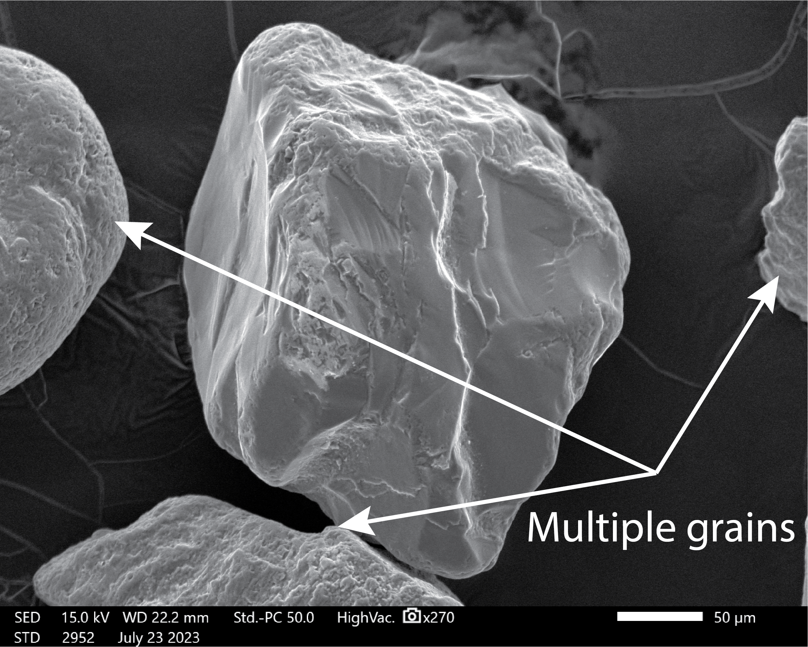
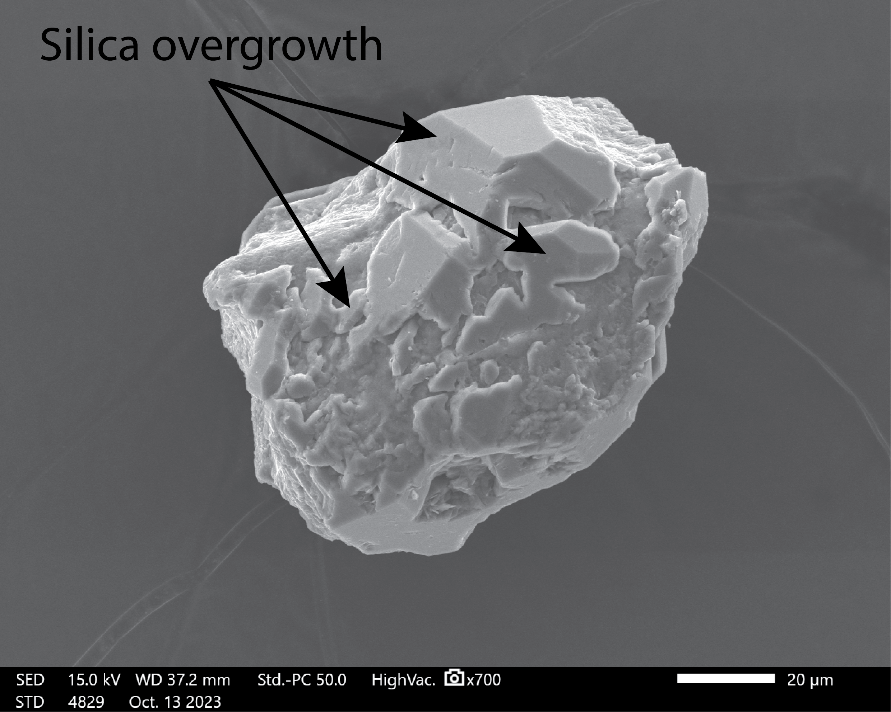
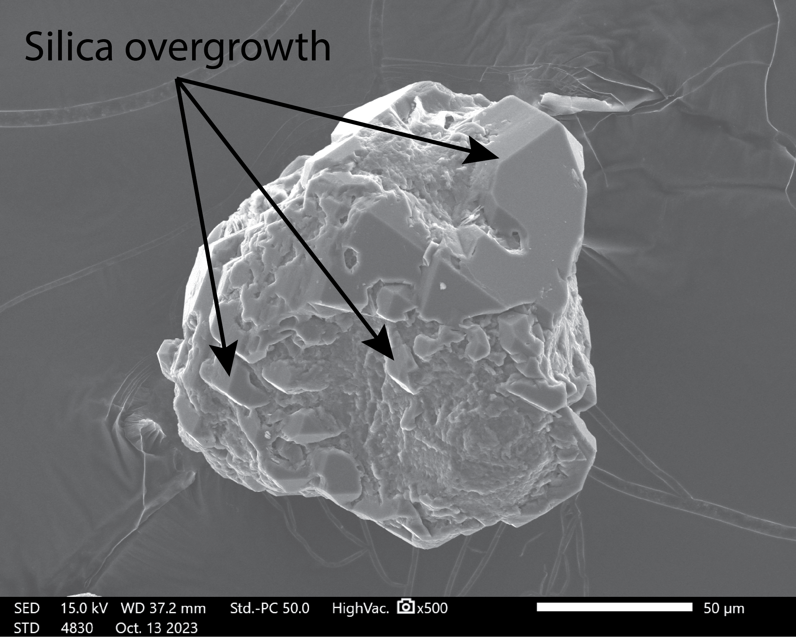
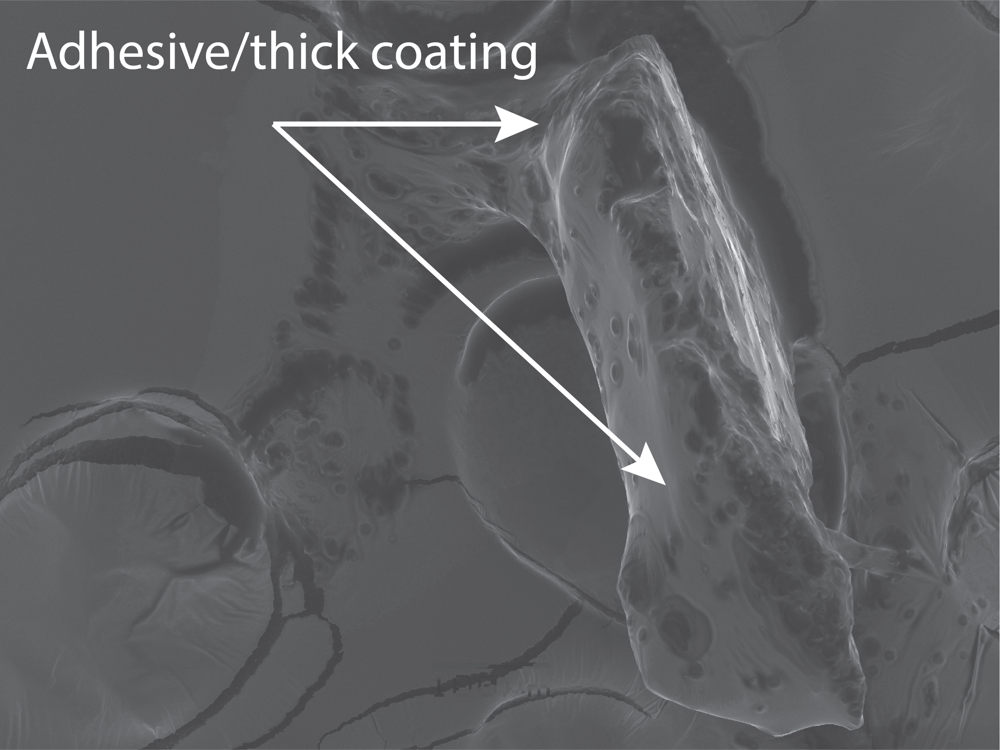
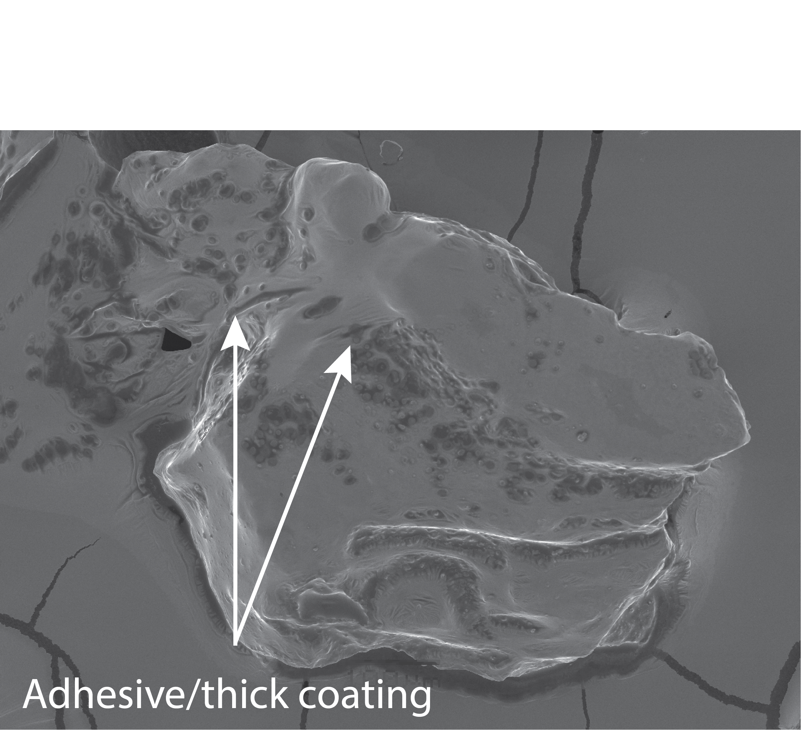

# Automated determination of transport and depositional environments in sand and sandstones

## Description
This repository includes all code related to the manuscript "Automated determination of transport and depositional environments in sand and sandstones" by Michael Hasson, M. Colin Marvin, and Mathieu Lapôtre. Using the files in this repository, anyone can use the model documented in our manuscript to identify the transport or depositional environment of scanning electron microscope (SEM) images of individual grains of quartz sand (as long as the meet the requirements for model input). The only configuration required is for a user to set the path to their folder of images and path where they would like the results to be saved.

The model has been validated on modern and ancient quartz grains, so it can be used on modern sediment and lithified rocks. 

Included are: 
- Tutorials for use with example outputs
- All code related to training and evaluating the model used in this study

## Using the tool:

Using the tool is very simple. Click this button to open the inference software in Google Colab:  

Google Colab is a free service that will let you quickly infer the classes of your images. No coding, downloading, or configuration is required. Simply click the button and follow the instructions inside.

From the Colab notebook, simply hit shift-enter or click the play buttons on each cell. This will run a demonstration of the expected outputs. 

To classify your own images, upload them to Google Colab and change the path and name of the sample. A new CSV file of model predictions will be saved in the "Predictions" folder that you can then download to your local computer. 

Be sure to look through the checklist (below and in the inference notebook) to make sure that your images meet the requirements for classification!

## Checklist

Before using the model, it is critical to make that images are suitable for model inference. Failure to do so will lead to inaccurate results. The requirements are:
1. Sand must be from terrestrial environments (eolian, glacial, beach, or fluvial).
2. No scale bars.
3. Individual grains only -- there can only be one sand grain per image.
4. The original grain shapes and textures must be present. If they have been obscured by diagenesis (e.g., silica cementation) or the sample preparation procedure, they will not produce valid results.

### Visual checklist examples:
Make sure that your images *do not* look like these before using the classifier!

1. Do your images contain scale bars?

<table>
  <tr>
    <td></td>
  </tr>
</table>

2. Is there only one grain per image?

<table>
  <tr>
    <td></td>
    <td></td>
  </tr>
</table>

3. Are the grain surfaces obscured by diagenesis?

<table>
  <tr>
    <td></td>
    <td></td>
  </tr>
</table>

4. Are the grain surfaces obscured by the sample preparation procedure?

<table>
  <tr>
    <td></td>
    <td></td>
  </tr>
</table>
